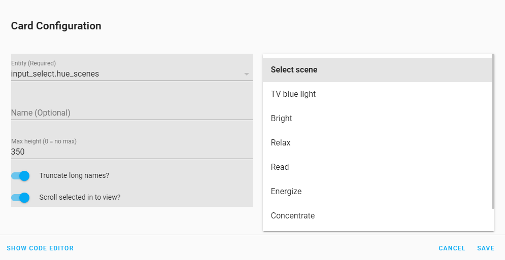
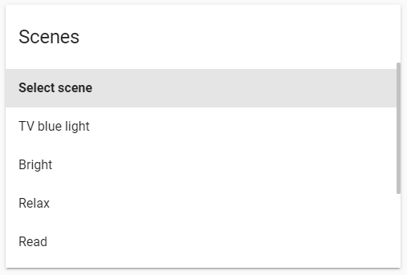

# Select list Card by [@mattieha](https://github.com/mattieha)

[![GitHub Release][releases-shield]][releases]
[![License][license-shield]](LICENSE.md)
[](https://github.com/custom-components/hacs)

Display an input_select entity as a list

## Usage

### Visual Editor

Select List Card supports Lovelace's Visual Editor. Click the + button to add a card and search for select list.



## Examples

### Default config



```yaml
type: 'custom:select-list-card'
entity: input_select.scenes
```

## Options

| Name              | Type    | Requirement  | Description                                 | Default             |
| ----------------- | ------- | ------------ | ------------------------------------------- | ------------------- |
| type              | string  | **Required** | `custom:select-list-card`                   |
| name              | string  | **Optional** | Card name                                   | ``                  |
| entity            | string  | **Optional** | Home Assistant input_select ID.             | `none`              |
| truncate          | boolean | **Optional** | Truncate option text                        | `true`              |
| scrollInToView    | boolean | **Optional** | Scroll active item in to view               | `true`              |
| maxHeight         | string  | **Optional** | Max height of the list                      | `350`               |


## Installation

### HACS

Install using [HACS](https://hacs.xyz) and add the following to your config:


```yaml
resources:
  - url: /hacsfiles/select-list-card/select-list-card.js
    type: module
```

### Manual

Download select-list-card.js from the [latest realease](https://github.com/mattieha/select-list-card/releases/latest) and place it in your `config/www` folder. Add the following to your config:

```yaml
resources:
  - url: /local/select-list-card.js
    type: module
```


## Support

Hey dude! Help me out for a couple of :beers: or a :coffee:!

[](https://www.buymeacoffee.com/mattijsha)
